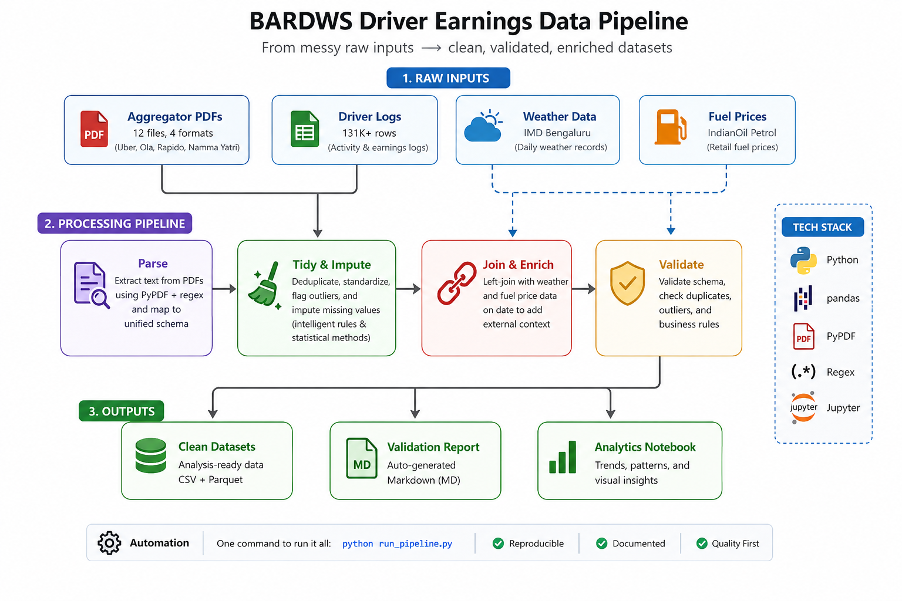
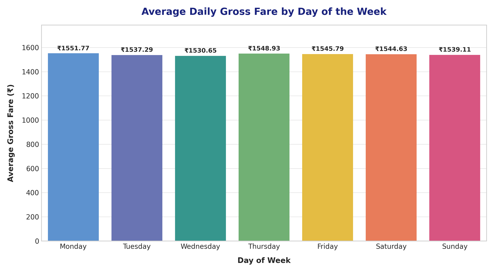
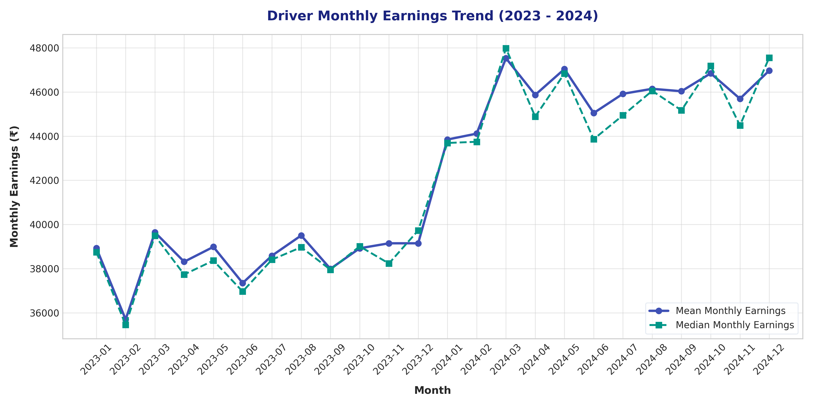

# BARDWS Driver Earnings Data Pipeline

A reproducible Python data pipeline that cleans, normalizes, and enriches aggregator earnings data and daily driver logs for the Bengaluru Auto-Rickshaw Drivers' Welfare Sangha (BARDWS).

## 1. Project Overview
This repository implements a local-first, privacy-compliant data pipeline that merges multi-source earnings and driver data. Specifically:
1.  **Aggregator Earnings Parser:** Extracts data from 12 PDF statements spanning 4 aggregators (Uber, Ola, Rapido, Namma Yatri) into a unified daily earnings schema.
2.  **Driver Logs Tidying:** Cleans 131k+ driver logs by resolving duplicates, flagging outlier shifts (hours_worked = 26), and imputing missing kilometers and fares based on group-level medians.
3.  **Weather and Fuel Enrichment:** Left-joins cleaned driver logs with daily weather records (precipitation, temperatures, humidity) and retail petrol price indexes from IndianOil.
4.  **Data Quality Validation:** Auto-generates a validation report checking schema conformance, duplicates, missingness, and outlier flags.
5.  **Analytics & Visualization:** Provides an analytics notebook analyzing day-of-week and monthly driver earnings trends.

### Pipeline Architecture


## 2. Directory Structure

```text
DA-009/
  01_parser/                      # Module stage code (D-01)
    ├── bardws_parser_aggregator_v1_2026-06-22.py   # PDF parsing stage
    ├── bardws_tidy_driver_v1_2026-06-22.py         # Tidying stage
    ├── bardws_join_driver_v1_2026-06-22.py         # Joining/enrichment stage
    └── bardws_validate_data_v1_2026-06-22.py       # Quality validation stage
  02_datasets/                    # Output datasets (D-02, D-03)
    ├── bardws_dataset_aggregator-earnings_v1_2026-06-22.csv
    ├── bardws_dataset_aggregator-earnings_v1_2026-06-22.parquet
    ├── bardws_dataset_driver-enriched_v1_2026-06-22.csv
    ├── bardws_dataset_driver-enriched_v1_2026-06-22.parquet
    ├── bardws_data_dictionary_v1_2026-06-22.md     # Schemas & lineage
    └── bardws_validation_report_v1_2026-06-22.md   # QC report
  03_notebook/                    # Deliverable notebook (D-04)
    └── bardws_notebook_analytics_v1_2026-06-22.ipynb
  assets/                         # Raw input data (unmodified)
    ├── aggregator_pdfs/          # 12 statement PDFs
    ├── driver_logs/              # Raw driver daily CSV
    ├── fuel_prices/              # Bengaluru daily fuel price CSV
    └── weather/                  # Bengaluru daily weather CSV
  LICENSE                         # MIT Open Source License
  README.md                       # Documentation (D-05)
  requirements.txt                # Pinned dependencies
  run_pipeline.py                 # Pipeline Orchestrator (one command)
```

## 3. Getting Started

### 3.1 Pinned Dependencies
The pipeline requires Python 3.12+ and dependencies pinned in `requirements.txt`.
To install all required packages, run:
```bash
pip install -r requirements.txt
```

### 3.2 Running the Pipeline
To execute the pipeline end-to-end, run the following single command from the repository root:
```bash
python run_pipeline.py
```
This script will:
1. Parse all 12 aggregator PDFs and save the normalized earnings table.
2. Load and tidy member driver logs (remove 80 duplicates, flag 12 outliers, impute missing metrics).
3. Merge driver activity logs with daily weather and IndianOil Petrol prices.
4. Export Parquet and CSV versions of both tables to the 02_datasets/ directory.
5. Generate a markdown quality report (02_datasets/bardws_validation_report_v1_2026-06-22.md) certifying that the output passed all validations.

## 4. Pipeline Logic & Data Cleaning

### 4.1 Imputation Methodology
-   **Missing Kilometers Driven (km_driven):**
    -   If a driver reports sick_day = 1 or hours_worked = 0, km_driven is filled with 0.0.
    -   If the driver is active, the missing kilometers are imputed as: hours_worked * driver_median_speed, using the individual driver's median speed. If no driver speed history exists, it falls back to the global median of 17.51 km/h.
-   **Missing Gross Fare (gross_fare_inr):**
    -   If a driver reports sick_day = 1 or hours_worked = 0, gross_fare_inr is filled with 0.0.
    -   If the driver is active, missing fare is imputed as: rides_completed * driver_median_fare_per_ride. If no historical rate exists for that driver, it falls back to the global median of 122.56 per ride.

### 4.2 Enrichment Rules
-   Weather daily summaries (from IMD Bengaluru) are matched to driver logs strictly on dates.
-   Daily fuel prices are filtered to IndianOil Petrol to establish a uniform fuel expense baseline.

## 5. Analytics & Visualizations
The pipeline's final enriched dataset supports downstream analytical profiling of driver earnings. The provided notebook (`03_notebook/bardws_notebook_analytics_v1_2026-06-22.ipynb`) generates key insights into earnings patterns:

### Day of Week Earnings Analysis
Analyzing daily median gross fare collections across Bengaluru demand zones:


### Monthly Earnings Trend
Lineage and trend analysis tracking the monthly growth, fuel prices, and weather impact on driver take-home earnings:


